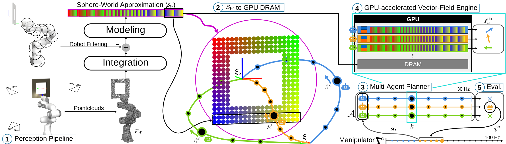

# G-MAPP: GPU-accelerated Multi-Agent Planning  and Perception for Reactive Motion Generation

<!-- [](LICENSE) -->

[](https://arxiv.org/abs/xxx.xxx)


<p align="center">
  
</p>


## Requirements


| Component | Version | Notes |
|-----------|---------|-------|
| [Ubuntu](docs/setup.md#ubuntu-2404) | 24.04 | Base OS |
| [Kernel](docs/setup.md#kernel-680) | 6.8.0 | |
| [Librealsense](docs/setup.md#librealsense) | 2.56.5 | |
| [ROS 2](docs/setup.md#ros-2) | Rolling | |
| [NVIDIA Driver](docs/setup.md#nvidia-driver) | 535 | or greater |
| [CUDA](docs/setup.md#cuda-126) | 12.6 | with compatibility pkg|
| [Open3D](docs/setup.md#open3d-cuda) | | CUDA build |


> Below are the ancillary packages that support the G-MAPP framework. G-MAPP is built using clang. Its dependencies will fail with default GCC building.

| Component | Version | Notes |
|-----------|---------|-------|
| [Clang](docs/setup.md#clang) | 18+ | |
| [CycloneDDS](docs/setup.md#cyclonedds) | | |
| [OpenMP](docs/setup.md#openmp) | | |


## Installation
> We recommend using **Timeshift** (`sudo apt install timeshift`) to create system backups before each critical installation stage.

The installation instructions for each component can be found in [docs/setup.md](docs/setup.md).

## Running

Instructions for running can be found in [docs/run.md](docs/run.md)

## Citation
If you found this work useful, please consider citing:

```bibtex
@article{bishnoi2026gmapp,
  author={Bishnoi, Tanmay and Laha, Riddhiman and Loẅ, Tobias and Chandy, Jose Alex and Figueredo, Luis F.C. and Haddadin, Sami},
  journal={IEEE Robotics and Automation Letters}, 
  title={G-MAPP: GPU-accelerated Multi-Agent Planning and Perception for Reactive Motion Generation}, 
  year={2026},
  volume={},
  number={},
  pages={},
  doi={},
  publisher={IEEE}
}
```